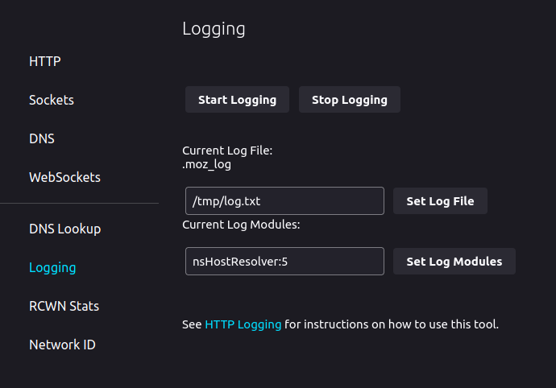

# NetworkAnotator

Anotator of network traffic

## Classification utility

This utility that can be run with `sudo bash classification_utility.sh -i <network interface> -c <output csv> -p <ports csv file>` mine information from command `lsof -n -i -P` and safe them to csv file `<output csv>`. Example results in `<output csv>`:

| Application | ID_dependency                     |
| ----------- | --------------------------------- |
| thunderbi   | 142.251.36.78(443)-192.168.1.109  |
| thunderbi   | 64.233.166.109(993)-192.168.1.109 |
| teams       | 52.114.104.65(443)-192.168.1.109  |
| slack       | 3.67.131.16(443)-192.168.1.109    |
| slack       | 35.176.23.94(443)-192.168.1.109   |
| GeckoMain   | 142.251.36.132(443)-192.168.1.109 |

ID_dependency is in format `<ip_1>(<port>)-<ip_1>` where device with IP address `<ip_1>` provides service under port `<port>` of device with ip address `<ip_2>`.

## Firefox log file

In firefox can be setted creating log file for DNS lookups by `about:networking#logging` in firefox search box. And fill the logging as like in picture:

Then before clicking on `Start Logging` go to `DNS` and by clicking on `Clear DNS Cache` clear records. Then go back to `Logging` and click on `Start Logging`.

Firefox will loggg DNS lookups to some file in folder `/tmp/` that starts with `log.txt`.

Then we can mine information about network traffic from this logging file and safe it to some csv file.

Test jupyter notebook for this function is `firefox_log_miner.ipynb`, python module for bash script is `firefox_dns_miner.py`.

Example results in `<output csv>` with firefox dns log miner turned on:

| Application                        | ID_dependency                     |
| ---------------------------------- | --------------------------------- |
| treatment.grammarly.com            | 35.173.119.102(443)-192.168.1.109 |
| gateway.facebook.com               | 157.240.30.13(443)-192.168.1.109  |
| www.youtube.com                    | 172.217.23.206(443)-192.168.1.109 |
| api.twitter.com                    | 104.244.42.194(443)-192.168.1.109 |
| twitter.com                        | 104.244.42.65(443)-192.168.1.109  |
| edge-chat.facebook.com             | 157.240.30.18(443)-192.168.1.109  |
| audio-ak-spotify-com.akamaized.net | 2.21.74.89(443)-192.168.1.109     |
